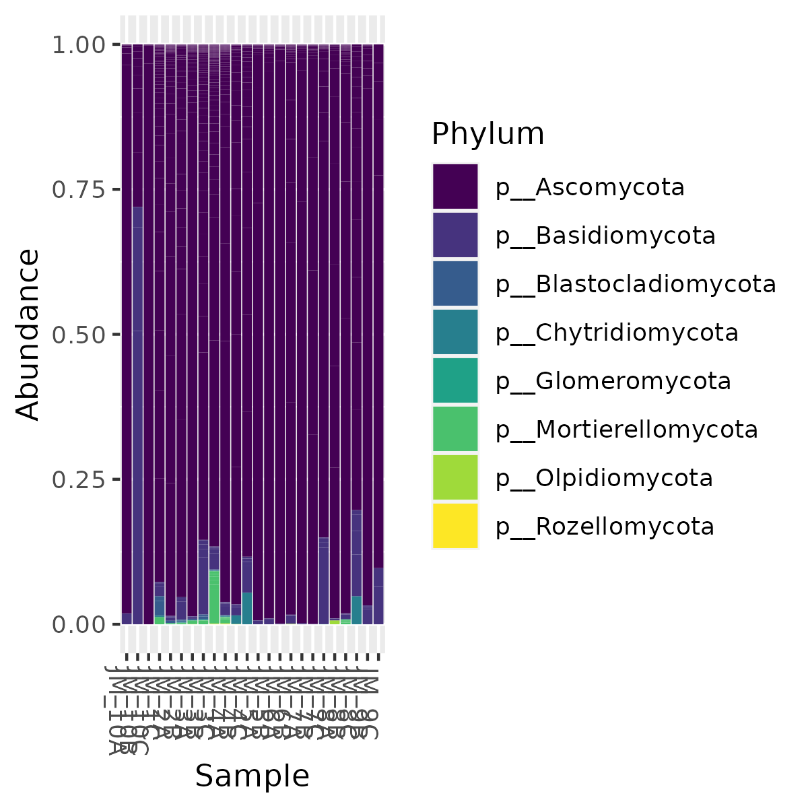

<head>
<link rel="preconnect" href="https://fonts.googleapis.com">
<link rel="preconnect" href="https://fonts.gstatic.com" crossorigin>
<link href="https://fonts.googleapis.com/css2?family=Roboto:wght@100&display=swap" rel="stylesheet">
</head>
<style>
body {
  font-family: 'Roboto', sans-serif;
  background-color: #1c4711;
  background-image: linear-gradient(to bottom right, #1c4711,#1c4711, #f2e291);
}
table {
  background-color: white
}
ul {
  list-style-type: none;
  margin: 0;
  padding: 0;
  overflow: hidden;
}

li {
  color: black;
  float: left;
}

li a {
  display: block;
  padding: 8px;
  color: white;
  font-size: 15px;
  font-weight: bold
}

h1 {
  font-size: 60px;
  color: white
}
h2 {
  color: white
}

.pagedtable-info {
  color: white;
  font-weight: bold;
}
.pagedtable-index {
  color: white;
  font-weight: bold;
}
.pagedtable-index-nav {
  color: white;
  font-weight: bold;
}
</style>

<ul>
  <li style="float: left"><a href="#contact">Contact Us</a></li>
  <li style="float: right"><a href="#multiple_regression">Multiple Regression</a></li>
  <li style="float: right"><a href="#phylum">Phylum</a></li>
  <li style="float: right"><a href="#taxonomy">Taxonomy</a></li>
</ul>

<hr>
# **Aquatic associated plant fungi across urbanization gradient**
<hr>
<p style="float: right; color: white; font-size: 15px; font-weight: bold">Utah County, UT is one of the fastest growing regions of the United States. With increased population density, it is important to analyze the effects of urbanization on the surrounding environment and the organisms occupying it. Although the effects of urbanization on watersheds are well-studied, microbial communities are less so. Here, we utilized a watershed with increasing urbanization to examine the effects of human population, impermeable surface, and industrialization densities on the mycobiome of the aquatic plant, Ranunculus aquatilis. We used high-throughput amplicon sequencing of 16S and ITS regions to interrogate bacterial and fungal community composition. We hypothesize that increasing pollutant stress on plants will reduce microbial community diversity. Sequence data acquisition is ongoing at the time of this writing.</p>
<br><br>
<hr>
<hr>
<hr>
<hr>
<hr>

```{r setup, include=FALSE}
knitr::opts_chunk$set(echo = FALSE)
```

<hr>
## **All taxonomy found along with absolute abundance** {#taxonomy}
```{r, echo=FALSE}

dat <- read.csv("taxonomy_counts.csv")

rmarkdown::paged_table(dat)
```
<br>
<p style="color: white; font-size: 15px; font-weight: bold">Lorem ipsum dolor sit amet, consectetur adipiscing elit, sed do eiusmod tempor incididunt ut labore et dolore magna aliqua. Posuere sollicitudin aliquam ultrices sagittis orci a scelerisque purus semper. Turpis tincidunt id aliquet risus feugiat in ante metus. Non quam lacus suspendisse faucibus interdum posuere lorem. Egestas diam in arcu cursus euismod quis. Elit duis tristique sollicitudin nibh. Mauris in aliquam sem fringilla ut morbi. Laoreet id donec ultrices tincidunt arcu non. Eget nullam non nisi est sit. Elit scelerisque mauris pellentesque pulvinar pellentesque. Vitae suscipit tellus mauris a diam. Tristique risus nec feugiat in fermentum posuere urna nec tincidunt. Nulla facilisi morbi tempus iaculis urna. Pellentesque elit eget gravida cum sociis natoque penatibus et magnis.</p>
<hr>

## **Phylum relative abundance in each sample** {#phylum}
```{r, echo=FALSE}

```
<br><br>
<p style="color: white; font-size: 15px; font-weight: bold">Lorem ipsum dolor sit amet, consectetur adipiscing elit, sed do eiusmod tempor incididunt ut labore et dolore magna aliqua. Posuere sollicitudin aliquam ultrices sagittis orci a scelerisque purus semper. Turpis tincidunt id aliquet risus feugiat in ante metus. Non quam lacus suspendisse faucibus interdum posuere lorem. Egestas diam in arcu cursus euismod quis. Elit duis tristique sollicitudin nibh. Mauris in aliquam sem fringilla ut morbi. Laoreet id donec ultrices tincidunt arcu non. Eget nullam non nisi est sit. Elit scelerisque mauris pellentesque pulvinar pellentesque. Vitae suscipit tellus mauris a diam. Tristique risus nec feugiat in fermentum posuere urna nec tincidunt. Nulla facilisi morbi tempus iaculis urna. Pellentesque elit eget gravida cum sociis natoque penatibus et magnis.</p>
<hr>

## **Multiple regression on matrices** {#multiple_regression}
```{r, echo=FALSE}
dat2 <- read.csv("MRM_stats_table.csv")
knitr::kable(dat2)
```
<p style="color: white; font-size: 15px; font-weight: bold">Lorem ipsum dolor sit amet, consectetur adipiscing elit, sed do eiusmod tempor incididunt ut labore et dolore magna aliqua. Posuere sollicitudin aliquam ultrices sagittis orci a scelerisque purus semper. Turpis tincidunt id aliquet risus feugiat in ante metus. Non quam lacus suspendisse faucibus interdum posuere lorem. Egestas diam in arcu cursus euismod quis. Elit duis tristique sollicitudin nibh. Mauris in aliquam sem fringilla ut morbi. Laoreet id donec ultrices tincidunt arcu non. Eget nullam non nisi est sit. Elit scelerisque mauris pellentesque pulvinar pellentesque. Vitae suscipit tellus mauris a diam. Tristique risus nec feugiat in fermentum posuere urna nec tincidunt. Nulla facilisi morbi tempus iaculis urna. Pellentesque elit eget gravida cum sociis natoque penatibus et magnis.</p>
<hr>
## **Contact Us** {#contact}
